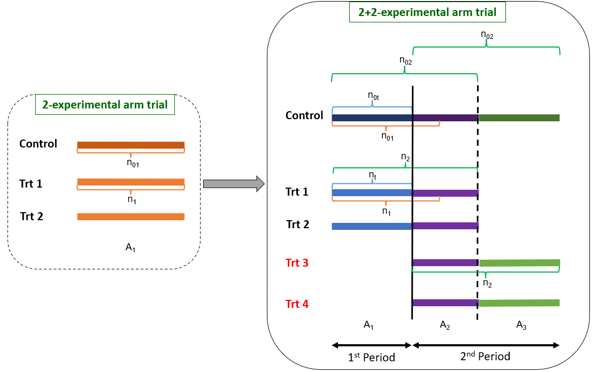
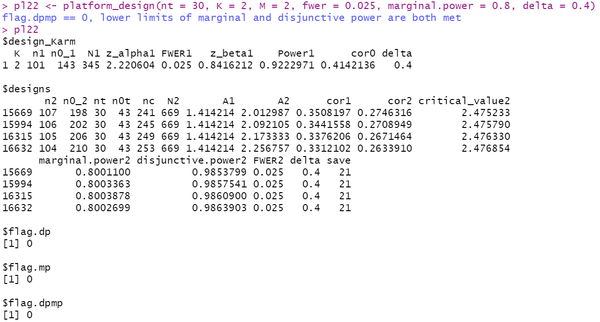

```{r, include = FALSE}
knitr::opts_chunk$set(
  collapse = TRUE,
  comment = "#>"
)
```

```{r setup, warning = FALSE}
library(PlatformDesign)
library(ggplot2)
```

This vignette provides step-by-step guidance for designing an optimal two-period multi-arm platform trial with delayed arms using the package `PlatformDesign`. Although the design method suits any K + M trial (K and M can be any positive integer), the example here shows how to design a 2 + 2 trial. The 2 + 2 trial begins with two experimental arms and one control arm in the first period and adds two new experimental arms at the start of the second period. (See Fig 1 for the scheme.) The goal of the proposed design method is to find the optimal design with a minimum total sample size under two prerequisites. Those prerequisites are 1) keeping FWER at the same user-defined level and 2) making the marginal and disjunctive power equal to or greater than their counterparts in the first period after adding the M new arms. For users who are less interested in the theoretical details, you can skip other steps and focus on Steps 1, 7, 13, and 14.



## step-by-step algorithm 
### Step 1: initial setup
Four design parameters for the first period of the design before adding new arms should be pre-specified: the number of initially opened experimental arms, the family-wise error rate denoted as $FWER_1$, the marginal type II error $\beta_1$, and the control arm allocation ratio (control to each experimental arm) denoted as $A_1$. In our method, we use $A_1=\sqrt{K}$ according to the K-root optimal allocation rule. In the following code, we assume $K=2$, $FWER_1=0.025$, $\beta_1=0.2$, $A_1=\sqrt{2}$. $z_{\beta_1}$ (z_beta1 in the following code) is the corresponding critical value for the power of $1-\beta_1$.
```{r}
K <- 2
FWER_1 <- 0.025
beta1 <- 0.2
z_beta1 <- qnorm(1-beta1) #z_(1-beta1)
A1 <- sqrt(K)
```


### Step 2: Correlation Matrix 1
We use $Z_1$ and $Z_2$ to denote the two test statistics for comparing the two experimental arm  to the control in the original design. Given $A_1$, the correlation between $Z_1$ and $Z_2$ (denoted as $\rho_0$) and the correlation matrix (denoted as $\Sigma_{1}$) can be calculated (see below).

First, by plugging $n_{1}$ and $n_{01}$ into formula (14) we have,
$$\rho_{0} = \frac{n_{0kk^{'}}}{\frac{(n_{01})^{2}}{n_{1}}+n_{01}}$$
where $n_1$ is the number of patients on each of the experimental arm and $n_{01}$ is the number of patients on the control in the first period.


Since the two experimental arms share a common control arm in the first period, that is, $n_{0kk^{'}}=n_{01}$. The correlation of $Z_1$ and $Z_2$ is computed as
$$\rho_0 = \frac{1}{(n_{01}/n_{1}+1)}=\frac{1}{(A_1+1)}=0.4142$$

We can see that in our "2+2"-experimental arm example, where K=2, we have
$$\Sigma_{1} =\begin{bmatrix}
 1& \rho_0\\ 
 \rho_0& 1
\end{bmatrix}=\begin{bmatrix}
 1& 0.4142\\ 
 0.4142& 1
\end{bmatrix}$$

Based on the above description, the function `one_stage_multiarm` can be used to find $\rho_0$ and the correlation matrix $\Sigma_1$ of $Z_1$ and $Z_2$ shown as below. 
```{r}
multi <- one_stage_multiarm(K = 2, fwer = 0.025, marginal.power = 0.8, delta = 0.4)
corMat1 <- multi$corMat1
corMat1
```

### Step 3: Critical Value 1
Given $K$, $\Sigma_{1}$ and $FWER_1$, we can find the associated critical value (denoted as $z_{1-\alpha_1}$) for the marginal type I error rate in the original design (denoted as $\alpha_1$) based on the following equation.

$$FWER_1=1-\int_{-\infty }^{z_{1-\alpha_1}}\int_{-\infty }^{z_{1-\alpha_1}}...\int_{-\infty }^{z_{1-\alpha_1}}\pi _{z}(Z(z_{1},z_{2},...z_{K}), 0, \Sigma_1 )dz_{1}dz_{2}...dz_{K}$$
This calculation can also be achieved using the function `one_stage_multiarm`.
```{r}
multi$z_alpha1
```

### Step 4: Sample Sizes 1
Given $\beta_1$, $A_1=\sqrt{K}$, an effective standardized effect size $\Delta$ ($\Delta$ is assumed to be 0.4 for all experimental arms in our paper), and $z_{1-\alpha_1}$ derived from the above, we can derive sample sizes for the experimental ($n_1$) and control arms ($n_{0_1}=A_1n_1=\sqrt{K}n_1$), respectively, as shown below.

Since we have

$$z_{1-\alpha_1}+z_{1-\beta_1}=\frac{\mu_i-\mu_0}{\sigma\sqrt{\frac{1}{n_{1}}+\frac{1}{\sqrt{K}n_{1}}}}=\frac{\Delta }{\sqrt{\frac{1}{n_{1}}+\frac{1}{\sqrt{K}n_{1}}}}$$
Therefore,

$$n_{1}= \frac{(z_{\alpha_1}+z_{\beta_1})^2}{\Delta^2}(1+\frac{\sqrt{K})}{K})$$

and $$n_{0_{1}}= \frac{(z_{\alpha_1}+z_{\beta_1})^2}{\Delta^2}(1+\sqrt{K})$$


In sum, the total sample size of the K-experimental arm trial is 
$$N_1=Kn_{1}+n_{0_{1}}$$

With our 2+2 trial example, we again use the function `one_stage_multiarm` to derive the sample sizes for the first period.
```{r}
multi$n1
multi$n0_1
multi$N1
```


### Step 5: Disjunctive Power 1
With $\beta_1$ and  $\Sigma_{1}$, we can also derive the overall (disjunctive) power $\Omega1=0.922$ based on equation below. 

$$\Omega_{1}=1-\int_{-\infty }^{z_{\beta1}}\int_{-\infty }^{z_{\beta1}}...\int_{-\infty }^{z_{\beta1}}\pi _{z}(Z(z_{1},z_{2},...z_{K}), 0, \sum )dz_{1}dz_{2}...dz_{K}$$
This result is also included as part of the output from the function `one_stage_multiarm` by `$Power1`.
```{r}
multi$Power1
```

From the above outputs, we can see that the computed disjunctive power is 0.922.

Based Steps 1 to 5, we demonstrate given $K, FWER_1$, marginal power $1-\beta_1$ and the standardized effect size $\Delta$, how to derive the marginal type I error rate $\alpha_1$ and its critical value, sample size $n_1$ for each of the experimental arm and $n_{0_1}$ for the control arm, and disjunctive power $\Omega_1$ for the first period of the platform design before adding new arms. 

In sum, the function `one_stage_multiarm`  in R package `PlatformDesign` can complete step 1 to 5 all at once. Below are the complete outputs generated by applying this function.
```{r}
multi
```

Based on these knowledge, we can introduce our proposed methods when adding new arms in the following from steps 6 to 14.

### Step 6: Time to Add New Arms
Timing is the first component to consider if planning to add new experimental arms during a study. In practice, we can use a fraction to denote the timing. In this paper, we use the absolute number of patients already being enrolled in the experimental arm (denoted as $n_t$) when new arms added to define the timing of adding. By this definition, at the time of adding new arms, number of patients enrolled in the control arm is $n_{0t}=[A_1n_t]$.

For example, the following codes describe a scenario if new arms are added when there have 30 patients enrolled for each of the experimental arms.
```{r}
nt <- 30
nt

n_0t <- ceiling(nt*A1)
n_0t
```

### Step 7: Initial Setup 2
Then we need to decide the updated family-wise error rate when adding new arms, denoted as $FWER_2$. In this paper, we control the $FWER_2$ at the same level to the $FWER_1$. With $FWER_2$, we can find the updated (marginal) type I error rate (denoted as $\alpha_1$). With $\alpha_1$, we can find the updated marginal power (denoted as $\omega_2=1-\beta_2$), and then the updated disjunctive power (denoted as $\Omega_2$). We will describe these updates with details in the following steps.

The goal of a two-period K+M experimental arm platform design is to minimize the sample size (denoted as $N_2$) while keeping the new marginal power (denoted as $\omega_2$) and disjunctive power (denoted as $\Omega_2$) no less than their counterparts in the first period (Namely, $\omega_1$ and $\Omega_1$). That is, we set the lower limit of  $\omega_2$ (denoted as $\omega_{2min}$) to be 0.8, the lower limit of $\Omega_2$ (denoted as $\Omega_{2min}$) to be 0.92 (which is obtained by using function `one_stage_multiarm`  in the previous steps) as for our 2+2 example.
These two limits will be used to select the recommended optimal design(s) (details later in Step 13).
```{r}
FWER_2 <- FWER_1
FWER_2
omega2_min <- 1-beta1
omega2_min
Omega2_min <- multi$Power1
Omega2_min
```

### Step 8: Admissible Set
Because we need to keep $FWER_2$ equal to $FWER_1$ when adding new arms, we then have to update $n_1$ to $n_2$ and $n_{01}$ to  $n_{02}$ for each experimental arm (See figure 1). Here $n_{2}$ and $n_{02}$ are the updated sample sizes for each of the experimental arms and for the control arm after adding new arms.

We define an admissible set for pairs of $(n_{2}, n_{02})$ based on the following three constraints. The first two constraints for $(n_{2}, n_{02})$ is related to the updated control allocation ratio after adding the new arms, denoted as $A_2$. In the first period with two experimental arms (before adding the new arms), the control allocation ratio is $A_1$. Once the two new experimental arms are added, we need to find an updated control allocation ratio $A_2$ to achieve desired design properties (e.g., control the FWER, achieve the marginal power, etc.). After the initially opened two experimental arms stop, the trial will again have only two experimental arms left. Therefore, the allocation ratio will go back from $A_2$ to $A_1$.

Here we have,

$$A_2=(n_{0_2}-n_{0t})/(n_2-n_t) > 0$$

where $n_t$ and $n_{0t}$ are number of enrolled patients for each of the experimental arms and the control at the time of adding new arms. That is, the value of $A_2$ needs to be a non-infinite positive number. For example, the first two constraints in our 2+2 example are

$$n_{0_2} > n_{0t}=43$$
and $$n_2>n_t=30$$

We also need to set an upper limit for the updated total sample size $N_2$. A reasonable upper limit is that $N_2$ should not exceed the required sample sizes (denoted as $S$) of separately conducting two multi-arm trials, i.e., a K-arm trial and a M-arm trial. To recap, $K$ and $M$ refer to number of experimental arms of the initially opened trial and number of later added experimental arms.

$$N_2=(K+M)n_2+n_{0_2}+n_{0t}= 4n_2+n_{0_2}+n_{0t}< S$$

One sensible choice of S could be 

$$S= \frac{(z_{\alpha_1}+z_{\beta_1})^2}{\Delta^2}(2+2\sqrt{K}+2\sqrt{M}+K+M)$$ 

, which is the sum of the number of patients to conduct a k-arm trial and a m-arm trial separately (in another word, no overlapping among the K+M experimental arms).


In our 1+2+2 example, we can take $$S=2N_1=690$$
```{r}
S <- 690
S
```

Under the above three constraints, the admissible set of $(n_{2}, n_{0_{2}})$ can be identified using the function `admiss` (integer points in triangle area in Fig.2).  The data set `pair3` contains all $(n_{2}, n_{02})$ pairs satisfying the 3 constraints introduced above.
```{r}
pair3 <- admiss(n1=101, n0_1=143, nt=30, ntrt=4, S=690)

ggplot(data=pair3, aes(x=Var1, y=Var2)) +
  geom_point() +
  geom_abline(intercept = 647, slope=-4, color="red") +
  geom_hline(yintercept=43, color="red")+
  geom_vline(xintercept=30, color="red") +
  xlim(0, 500)+
  ylim(0,1000)+
  xlab("n2")+
  ylab("n02")
```

### Step 9: Correlation Matrix 2
For each pair of $(n_{2}, n_{0_{2}})$ in the admissible set the updated correlation matrix of z statistics $\sum_{2}$ of four test statistics $(Z_1,Z_2,Z_3,Z_4)$ can be derived based on equation (7) in the paper, by plugging in $n_{2}$ and $n_{0_{2}}$. 

$$\rho_{k, k^{'}} = \frac{n_{0kk^{'}}}{\frac{(n_{0_{2}})^{2}}{n_{2}}+n_{0_{2}}}$$

Specifically, between the initially opened two experimental arms (and between the two newly added arms), the shared control now is $n_{0kk^{'}}=n_{02}$. Therefore, the correlation of Z statistics between these two initially opened experimental arms (and between the two newly added arms) is

$$\rho_1 = \frac{1}{(n_{0_2}/n_2+1)}$$. 


The number of shared controls between one initially opened experimental arm and one delayed experimental arm is $n_{0kk^{'}}=n_{0_2}-n_{0t}$
Therefore, the correlation of the Z test statistics between these two experimental arms is

$$\rho_2 = \frac{n_{0_2}-n_{0t}}{(n_{0_2}^2/n_2+n_{0_2})}$$.

To be specific, in our 2+2-arm example, we have the updated $\Sigma_2$ as, 
$$\Sigma_2 =\begin{bmatrix}
1 & \rho_1 & \rho_2 & \rho_2\\ 
\rho_1 &  1&  \rho_2& \rho_2\\ 
\rho_2 &  \rho_2&  1& \rho_1\\ 
\rho_2 &  \rho_2&  \rho_1 & 1
\end{bmatrix}$$


### Step 10: Critical Value 2
Now we can use $FWER_2$ and $\Sigma_{2}$ to calculate the updated marginal type I error $\alpha_2$ and the corresponding critical value $z_{1-\alpha_2}$ for each pair of $(n_{2}, n_{02})$ in the admissible set found in \textbf{Step 8}).

$$FWER_2=1-\int_{-\infty }^{z_{1-\alpha_2}}\int_{-\infty }^{z_{1-\alpha_2}}...\int_{-\infty }^{z_{1-\alpha_2}}\pi _{z}(Z(z_{1},z_{2},...z_{K+M}), 0, \Sigma_2 )dz_{1}dz_{2}...dz_{K+M}$$

### Step 11: Marginal Power 2
With $n_1$, $n_{01}$, ${\alpha_1}$, ${\beta_1}$ and ${\alpha_2}$, we can use the following equation to calculate the updated marginal power $\omega_2=1-\beta_2$ for each pair of $(n_{2}, n_{02})$ from $z_{1-\beta_2}$.

$$z_{1-\beta2 }=\sqrt{\frac{\frac{1} {n_1}+\frac{1}{n_{0_1}}}{\frac{1}{n_2}+\frac{1}{n_{0_2}}}}(z_{1-\alpha1} + z_{1-\beta1})- z_{1-\alpha2}$$ 

### Step 12: Disjunctive Power 2
With the updated marginal power $\omega2=1-\beta_2$ and $\Sigma_2$, we can derive the new disjunctive power $\Omega_2$ for each pair of $(n_{2}, n_{0_{2}})$ using the following equation by plugging in $\beta=\beta_2$.

$$\Omega_{2}=1-\int_{-\infty }^{z_{\beta2}}\int_{-\infty }^{z_{\beta2}}...\int_{-\infty }^{z_{\beta2}}\pi _{z}(Z(z_{1},z_{2},...z_{K+M}), 0, \Sigma_2 )dz_{1}dz_{2}...dz_{K+M}$$

### Step 13: Design Selection
In our "2+2" example, we get $\omega_2$ and $\Omega_2$ from all of the 29040 pairs of $(n_i,n_{0i})$ in the entire admissible set obtained with the function `admiss`. We then perform a 2-step selection procedure to obtain the recommended design(s): 1) first we only keep the designs with $\omega_2$ and $\Omega_2$ above or equal to $\omega_1$ and $\Omega_1$, respectively (i.e., lower limits decided in Step 7); 2) next, among those selected ones we further narrow down to the designs with the smallest sample size $N_2$, which we refer to as the recommended designs (See Fig 2).

Given $n_t$, $K$, $M$, $FWER_1$, $\omega_1$, $\omega_{2_{min}}$ and $\Delta$, the function `platform_Design` can provide the recommended designs with the minimum sample size among those having $\omega_2$ and $\Omega_2$ no less than their counterparts in the original design. The value of $\omega_{2_{min}}$ defaults to $\omega_1$, therefore we don't have to include it in the code below explicitly.
```{r, eval=F}
design <- platform_design(nt = 30, K = 2, M = 2, fwer = 0.025, marginal.power = 0.8, delta = 0.4)
design$designs
```



\bigskip
As we can see from above, it is possible to have multiple different recommended pairs all having the same $N_2$. Each of the recommended designs contains a full set of parameters readily to be used for conducting a platform trial with K original and M new experimental arms added at the informational time $n_t$.

For example, if we choose the design 15669, in this trial, assuming the additional two experimental arms will be added when 30 patients have been enrolled for each of the first two experimental arms, the total sample size is 669. Among the 669, in the first period, the planned sample sizes for each of two experimental arms and for the control are $n_1=101$ and $n_{01}=143$ with allocation ratio of $A_1=1.414$. The correlation between the two test statistics is 0.35. The corresponding critical value for controlling the FWER is 2.220. The marginal power is 0.8 and corresponding disjunctive power is 0.922.

Once the two additional experimental arms are added, the updated sample sizes for each of the experimental arms and the control are $n_2=107$ and $n_{02}=198$ with the "optimal allocation ratio" to be $A_2=2.01$ in the overlapping stage in the second period. In the overlapping stage, the correlation between the two test statistics is 0.27. The corresponding critical value for controlling the FWER is 2.475. The marginal power is 0.8 and corresponding disjunctive power is 0.985.

### Step 14: Final Decision
As we can see from Step 13, although the total sample size is the same for all the 4 recommended designs, the other parameters can be different. Therefore, we can choose a final design based on our needs according to the other parameters. For example, if we would like to choose a design with the largest disjunctive power $\Omega_2$, our final choice then goes to the design in the last row of the result above (design #16632).
 
As a result, we also can calculate the reduction in the total sample size by comparing this 2+2  platform design to two separate 3-arm trials. The size of reduction is, 

$$S-N_{2_{min}}=690-669=21$$

\bigskip
### Notes
If the $\omega_{2_{min}}$ and $\Omega_{2_{min}}$ in Step 7 can not be met at the same time. The algorithm in function `platform_Design` will return the designs with smallest $N_2$ but only meets one of the two constraints. In case we are not satisfied with the result or if none of the two constraints can be met, we can choose from the two options below:
	1. Go back to Step 7 to decrease the values of $\omega_{2_{min}}$. After that, repeat Steps 8 to 14 again. Or,
	2. Go back to Step 6 to set up a smaller $n_t$ (and therefore smaller $n_{0t}$) - that is, increasing overlapping among initially and later added experimental arms. The rationale is the later the new arms are added, the less likely we can find designs satisfying both limits defined in Step 7. After that, repeat Steps 8 to 14 again. This is only feasible if the situation allows us to change the timing of adding new arm. If this is not possible, we can always go with the first option instead.

## Author(s)
    Xiaomeng Yuan, Haitao Pan

## References
    1. Pan, H., Yuan, X. and Ye, J. (2022). An optimal two-period multi-arm confirmatory platform design with adding new arms. Submitted.

    2. Dunnett, C. W. (1955). A multiple comparison procedure for comparing several treatments with a control. Journal of the American Statistical Association, 50(272), 1096-1121.
    
